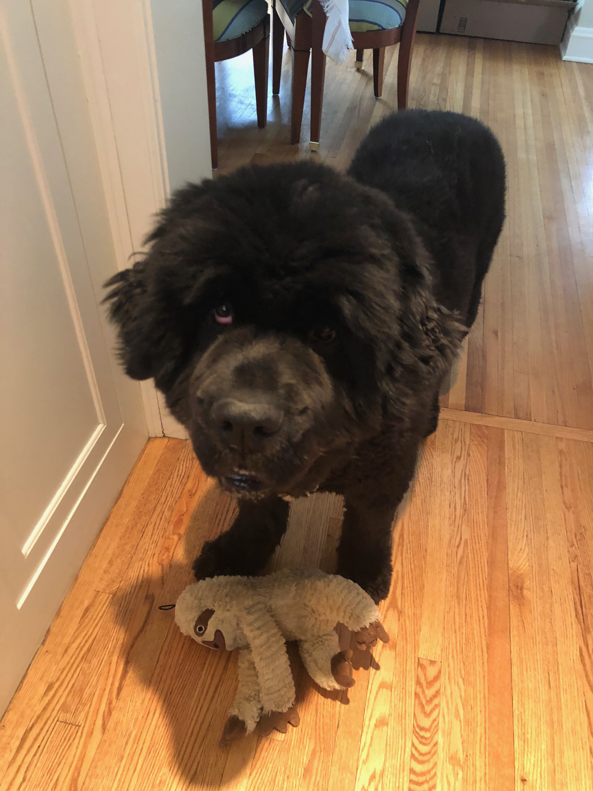

## Academic
I am a graduate student at Columbia University's Mailman School of Public Health. I am studying Health Policy and Management with a concentration in Applied Biostatistics. My data skills include R, SAS, SQL, Microsoft Excel and Access, and STATA. 

## Professional
Upon graduation I am hoping to work on fraud, waste, and abuse in the healthcare system through data analytics and innovative, policy-driven problem solving. 

## Personal
I grew up in Minneapolis, Minnesota. My interests include running, yoga, and the Minnesota Twins. I have two Newfoundland dogs:

### Mayzie

### Wilson

