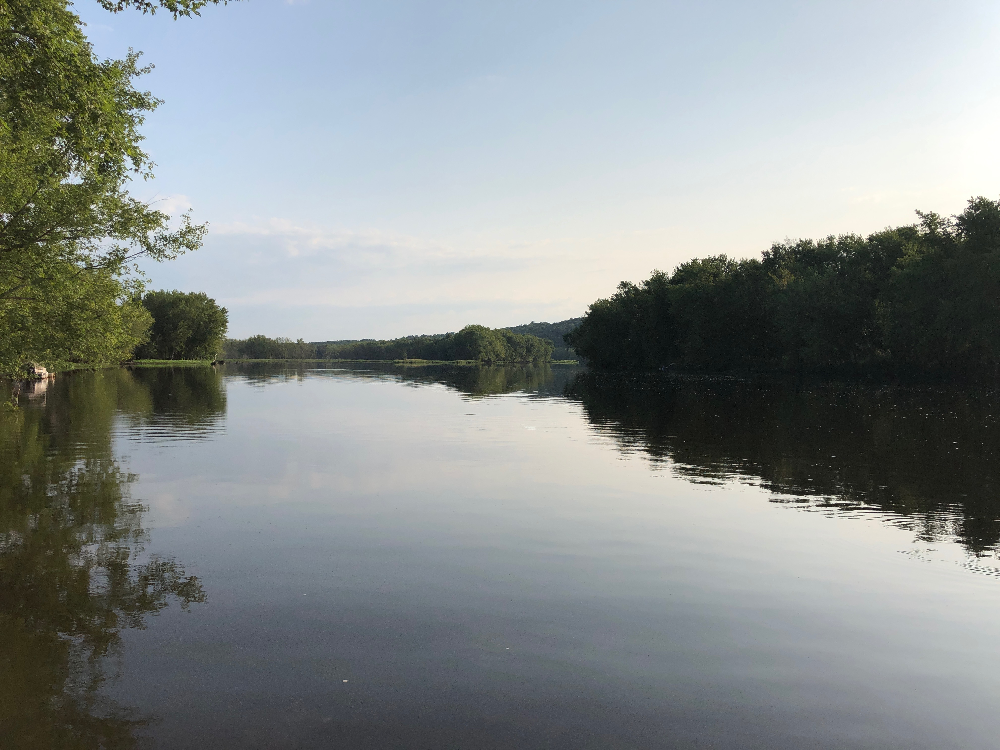
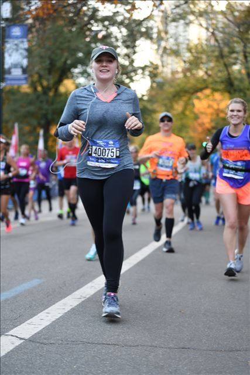

## Welcome! 

My name is Hannah Bowlin. I'm an MPH student at Columbia University studying health policy and management and applied biostatistics. My professional interests include value-based payments, increasing revenue cycle efficiency, and improving healthcare data analytics. 

Learn more about me [here](about.html), read my resume [here](resume.html), or just enjoy this picture of the St. Croix River in August.

  

### Hobbies
In my spare time I love running, doing yoga, and following Minnesota sports (no matter how often they break my heart). 

 _NYC Marathon 2018_

